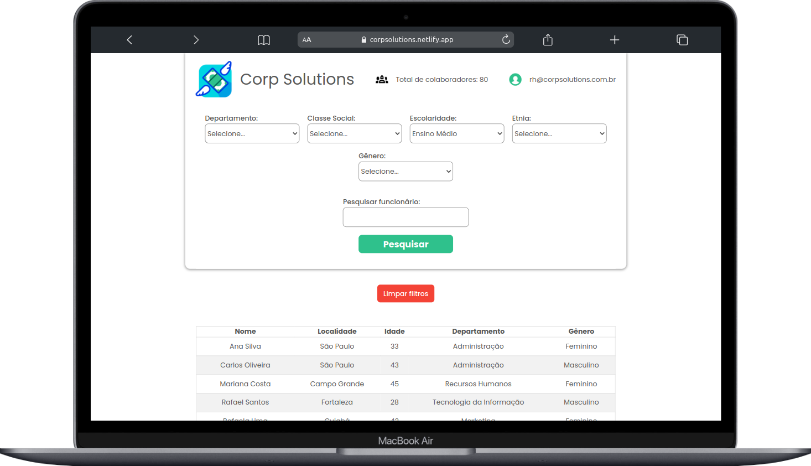

# Corp Solutions

## O que é possível com a aplicação?

Nesta aplicação, chegamos à conclusão de que mais do que apenas divulgar-se como empresa inclusiva, é importante saber onde atuar. Para isso criamos um dashboard onde é possível que o responsável do RH tenha acesso à todas as informações acerca dos colaboradores, além de métricas, metas e acesso à possíveis soluções. Nesse dashboard é possível:

- Filtrar por departamento
- Filtrar por classe social
- Filtrar por escolaridade
- Filtrar por etnia
- Filtrar por gênero
- Pesquisar por nome

## Como acessar a aplicação?

**Caso queira acessar o app oficial, basta acessar este [link](https://corpsolutions.netlify.app/)**.

## Como foi construído?

A aplicação foi feita usando a componentização de elementos afim de manter a legibilidade e escalabilidade do código.

Toda a aplicação é dinâmica, desde as os os gráfico em barras gerados que mostram se a meta de diversidade por público foi atingida até os textos descrevendo cada meta.

É possível notar o o botão “Como melhorar?” sempre que um público possui uma meta que ainda não foi atingida.

Na seção de filtros, é possível limpar os filtros após utilizá-los, além de ser mostrada uma mensagem na tela quando nenhum colaborador é encontrado naquele filtro.

Após a tabela, sempre é gerado um card com insights sobre o filtro usado, como média de idade, cidade mais recorrente, etc.

As tecnologias usadas serão mostradas abaixo.

## **🛠** Tecnologias Utilizadas

- **React.js**: Biblioteca JavaScript para construção de interfaces de usuário (UI) baseada em componentes.
- **TypeScript** (**`typescript`**): Um superset de JavaScript que adiciona tipagem estática ao JavaScript.
- **Styled Components**: Biblioteca para React e React Native que permite escrever estilos CSS diretamente dentro de componentes JavaScript.
- **Autoprefixer** (**`autoprefixer`**): Um plugin PostCSS que adiciona automaticamente prefixos de fornecedor aos estilos CSS, garantindo compatibilidade com diferentes navegadores.
- **ESLint** (**`eslint`**): Uma ferramenta de análise de código estática para identificar e relatar padrões problemáticos no código JavaScript.
- **Tailwind CSS** (**`tailwindcss`**): Um framework CSS utilitário que permite criar rapidamente interfaces de usuário personalizadas, aplicando classes pré-definidas em HTML.
- **Vite** (**`vite`**): Um construtor de aplicativos da web rápido que usa a importação ES nativa para oferecer um tempo de inicialização rápido e um servidor de desenvolvimento com recarregamento rápido.

## Dashboard em funcionamento:

O aplicativo foi criado pensando tanto em dispositivos móveis quanto em tablets e desktops.

A aplicação foi estilizada com Styled Components do React e com a ajuda do Tailwind em parte da página de usuários. Tudo para manter um design intuitivo, moderno e de fácil acessibilidade.

### Mobile:

<div style="display: flex; justify-content: center;">
    <div style="display: flex; flex-direction: row; gap: 40px;">
    
    
    </div>
</div>

---

### Desktop:

.png)



---

## Como rodar este projeto no seu computador?

Para rodar este projeto localmente, é necessário atender alguns requisitos.

- **Pré-requisitos:**
    - Ter o Git instalado em seu terminal. **[link](https://github.com/git-guides/install-git)**
    - Ter uma chave SSH atrelada à sua conta no GitHub. [**link**](https://docs.github.com/en/authentication/connecting-to-github-with-ssh)
    

**Para rodar o projeto localmente, siga estes passos:**

Clone o projeto

```bash
# Com SSH
$ git clone git@github.com:Wesleyhmendes/adahack-2024-frontend.git
```

Mude para a pasta raiz:

```bash
$ cd adahack-2024-frontend
```

Instale as dependências:

```bash
$ npm install
```

Para rodar a aplicação localmente:

```bash
# pasta raíz
$ npm run dev
```

---

## Autores

<div style="display: flex; flex-direction: row;">
    <div style="flex: 1; padding-right: 20px;">
        
    </div>
    <div style="flex: 2;">
        <h3>Wesley Mendes <a href="https://emojiterra.com/pt/foguete/" target="_blank">🚀</a></h3>
        <p>Desenvolvedor Web Full Stack | Java | Next.js | Node.js | TypeScript | MySql | PostgreSQL | Python</p>
        <p><a href="https://www.linkedin.com/in/wesley-mendes/" target="_blank">Linkedin</a></p>
        <p>Email: wesleymendes123321@gmail.com</p>
    </div>
</div>


<div style="display: flex; flex-direction: row;">
    <div style="flex: 1; padding-right: 20px;">
        
    </div>
    <div style="flex: 2;">
        <h3>Haralan Santana</h3>
        <p>Desenvolvedor Frontend | HTML | CSS | JavaScript | React | Next | TypeScript | Tailwind | Bootstrap</p>
        <p><a href="https://www.linkedin.com/in/haralan-santana/" target="_blank">Linkedin</a></p>
    </div>
</div>


<div style="display: flex; flex-direction: row;">
    <div style="flex: 1; padding-right: 20px;">
        
    </div>
    <div style="flex: 2;">
        <h3>Helder Santos</h3>
        <p>Web developer - PHP</p>
        <p><a href="https://www.linkedin.com/in/helder-ss/" target="_blank">Linkedin</a></p>
    </div>
</div>

<div style="display: flex; flex-direction: row;">
    <div style="flex: 1; padding-right: 20px;">
        
    </div>
    <div style="flex: 2;">
        <h3>Matheus Medeiros</h3>
        <p>Assistente de Gestão</p>
        <p><a href="https://www.linkedin.com/in/matheus-medeiros-9644a312b/" target="_blank">Linkedin</a></p>
    </div>
</div>
